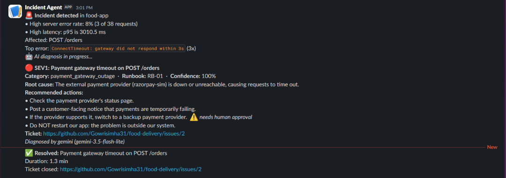
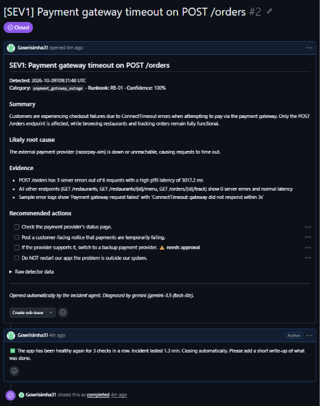
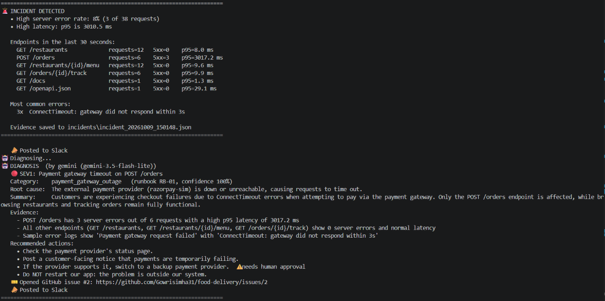
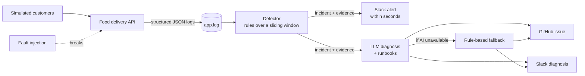

# 🚨 AI Incident Triage Agent

An AI agent that watches a running application, **detects incidents within seconds**, **diagnoses the root cause** with an LLM grounded in team runbooks, and **takes action**: alerting Slack and opening (then auto-closing) GitHub issues, while leaving risky fixes for a human to approve.

Built and evaluated on a food delivery backend with realistic, injected failures.

| Detection | Time to detect | Root-cause accuracy | Severity accuracy |
|:---:|:---:|:---:|:---:|
| **25/25** | **15.5s** average | **100%** | **100%** (up from 72%) |

<sub>Measured on 30 automatically injected incidents, including adversarial cases. See [Evaluation](#-evaluation).</sub>

---

## 📸 Demo

**The agent alerts the team in Slack, then follows up with its diagnosis:**



**It opens a GitHub issue with the diagnosis and an action checklist, and closes it when the app recovers:**



**What the agent sees and decides:**



---

## 🧩 The problem

When software breaks, an on-call engineer has to notice it, dig through logs to find the cause, judge how serious it is, and alert the right people, often at 3am. This first round of investigation is called **triage**. It's slow, repetitive, and the same failures happen again and again.

This project automates triage.

## ⚙️ How it works



1. **A realistic app to watch.** A FastAPI food delivery backend (restaurants, orders, payments, delivery tracking) with a SQL database and structured JSON logging with request IDs.
2. **Realistic traffic.** A load generator simulates customers browsing, ordering and occasionally making mistakes, creating a normal baseline.
3. **Realistic failures.** Fault injection simulates four common real-world incidents:

   | Fault | Real-world category | What it looks like |
   |---|---|---|
   | Payment gateway down | External dependency failure | Only orders fail, after a 3s timeout |
   | Slow database | Performance degradation | **No errors**, just slowness everywhere |
   | Connection pool exhausted | Resource exhaustion | Every page fails |
   | Bad deployment | Buggy release | Errors start after a deploy, only for one restaurant |

4. **Detection.** A rules-based detector reads new log lines every 5 seconds and tracks error rate, p95 latency and traffic over a 30-second sliding window. It deduplicates alerts and requires sustained recovery before resolving, to avoid flapping.
5. **Diagnosis.** The evidence (per-endpoint metrics, top errors, recent deployments, sample logs) is sent with the team's **runbooks** to an LLM (Gemini), which returns a **schema-validated** diagnosis: category, severity, root cause, supporting evidence and recommended actions.
6. **Action.** The agent alerts Slack **immediately** (before the AI finishes), opens a GitHub issue with the diagnosis and an action checklist, and comments on and closes the issue once the app is healthy again.

## ✨ Key design decisions

- **Cheap rules watch constantly; the expensive LLM is only called when needed.** This keeps cost and noise low.
- **Grounded diagnosis.** The LLM must choose from the team's runbooks (including decoy runbooks for failures that never occur), and its output is validated with Pydantic. Invalid replies are rejected.
- **Human in the loop.** The agent can notify and open tickets on its own. Anything that changes the system (restarts, rollbacks) is only *recommended* and flagged as needing human approval.
- **Built to survive its own dependencies failing.** Every external call has a timeout. LLM calls use retries with backoff, a fallback model, and a total time budget, then fall back to rule-based diagnosis. If Slack or GitHub is down, the agent logs a warning and keeps working.
- **Least privilege and secrets management.** Secrets live in `.env` (never committed). The GitHub token is scoped to one repository with only the Issues permission.
- **Honest evaluation.** Fault switches are recorded in a separate log the agent never reads, so it only ever sees symptoms, never the answer.

## 📊 Evaluation

Most AI projects stop at "it works when I try it." This one is measured.

`evaluate.py` runs rounds of randomly chosen scenarios: the four faults, an **adversarial trap** (a bad deployment and rollback happen just before an unrelated payment gateway outage, tempting the agent to blame the deployment), and **no-fault control rounds** to measure false alarms. Because the evaluation chooses the fault, every case has a known correct answer. `score.py` then grades the LLM's diagnoses against those labels, alongside a rule-based baseline.

**Results on 30 rounds** (25 faults, 5 controls):

| Metric | Result |
|---|---|
| Faults detected | **25/25 (100%)** |
| Mean time to detect | **15.5s** (median 15.0s) |
| LLM root-cause accuracy | **25/25 (100%)**, including **5/5 adversarial trap cases** |
| LLM severity accuracy | **72% → 100%** after error analysis |
| Mean LLM diagnosis time | ~6–7s |
| False alarms | 1 of 5 control rounds (traced to a monitoring bug, fixed) |

### What the error analysis found

- **Severity was under- and over-estimated.** Connection-pool exhaustion was rated too low because incidents are detected early (at ~8% errors), before their full impact shows. Partial failures were rated too high because the severity definitions were ambiguous. Adding typical severities to the runbooks and clearer guidance to the prompt raised severity accuracy **from 72% to 100%** on the same frozen test set.
- **The one false alarm was a bug in the monitoring itself.** The app and traffic were healthy, but the detector's live log reader had missed lines. The reader was rewritten to track byte offsets, buffer partially written lines, and tolerate briefly locked files.
- **Partial failures are slower to detect.** The bad deployment (~7% of requests failing) took 25s on average, versus ~10s for total failures, a real trade-off between detection speed and false alarms.

**Limitations, honestly stated:** 30 cases is a small sample. The prompt was refined on the same cases it was scored on, so a fresh held-out set is the next step. The rule-based baseline also scores 100%, because it was written for these exact four faults; the LLM's advantage should show on unseen failure types, which is the natural next experiment.

Full report: [`eval/report.md`](eval/report.md)

## 🛠️ Tech stack

**Backend:** Python, FastAPI, SQLModel (SQLAlchemy), SQLite, Pydantic
**AI:** Google Gemini (structured output), runbook-grounded prompting
**Observability:** structured JSON logging, request correlation IDs, p95 latency, sliding-window detection
**Integrations:** Slack incoming webhooks, GitHub REST API
**Testing:** fault injection, synthetic traffic, automated offline evaluation

## 🚀 Running it locally

**1. Install**
```bash
git clone https://github.com/Gowrisimha31/food-delivery.git
cd food-delivery
python -m venv venv
venv\Scripts\activate          # Mac/Linux: source venv/bin/activate
pip install -r requirements.txt
```

**2. Configure:** copy `.env.example` to `.env` and fill in your values. Without an API key, set `AI_PROVIDER=rules` and the agent uses rule-based diagnosis. Without Slack or GitHub settings, those steps are simply skipped.

**3. Run** (three terminals, each with the virtual environment activated)
```bash
uvicorn main:app --reload      # 1: the app       → http://127.0.0.1:8000/docs
python traffic.py              # 2: simulated customers
python agent.py                # 3: the incident agent
```

**4. Break something:** in `/docs`, use **POST /chaos/{name}/on** with `payment_gateway_down`, `slow_database`, `db_connections_exhausted` or `bad_deploy`. Turn it off again with **POST /chaos/{name}/off**.

**5. Evaluate** (stop the agent first, keep the app and traffic running)
```bash
python evaluate.py 24          # collect labelled incidents
python score.py                # grade them → eval/report.md
```

## 📁 Project structure

```
├── main.py            # App entry point, request logging middleware
├── restaurants.py     # Restaurants and menus
├── orders.py          # Orders and billing (transactional)
├── payments.py        # Simulated payment gateway
├── delivery.py        # Delivery tracking
├── models.py          # Database tables
├── database.py        # Database connection and seed data
├── logger.py          # Structured JSON logging
├── chaos.py           # Fault injection switches
├── deploy.py          # Deployment and rollback events
├── traffic.py         # Simulated customer traffic
├── detector.py        # Incident detection over a sliding window
├── diagnoser.py       # LLM diagnosis with retries, fallbacks and validation
├── runbooks.md        # Runbooks the LLM is grounded in
├── notifier.py        # Slack and GitHub actions
├── agent.py           # The agent: detect → alert → diagnose → ticket → resolve
├── evaluate.py        # Collects labelled test incidents
├── score.py           # Scores diagnoses and writes the report
└── eval/              # Evaluation cases, results and report
```

## 🔭 Future work

- Test the LLM on **failure types the rules were never written for**, to measure generalization
- **Containerize** with Docker and Docker Compose for one-command setup
- Add metrics and dashboards (Prometheus, Grafana)
- Let the agent **call tools to investigate** (query metrics, read more logs) rather than receive a fixed evidence bundle
- Interactive Slack approvals for risky actions, and escalation for unacknowledged SEV1s